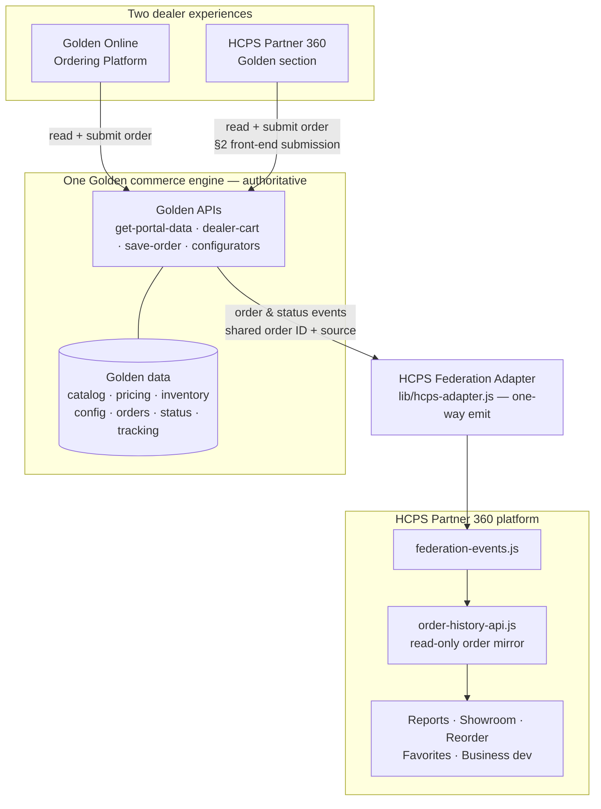

# Golden ⇄ HCPS Partner 360 — Shared Commerce Engine Integration

**Addendum to:** FEDERATED_ARCHITECTURE.md (proposes **v1.2.0**)
**Status:** Proposed — for adoption by both the HCPS and Golden dev efforts
**Owner:** Angelo Audia (HCPS)

> **Model:** *Two dealer experiences → one Golden commerce engine → one synchronized order record.*
> Dealers choose whichever interface suits them; HCPS never maintains a second copy of Golden inventory, configuration, or order data.

---

## 1. Principle

The **Golden commerce backend is the single authoritative engine** for Golden products, dealer pricing, live inventory, configurators, orders, status, and tracking. The **Golden Online Ordering Platform** and **HCPS Partner 360** are two *front-ends* on that one engine. Partner 360 consumes Golden data and functionality through Golden's own APIs; it does **not** create a second Golden catalog, inventory store, or order table.

This upholds the federation doctrine already adopted in v1.1.0:
- **Federation, not fusion** — separate databases; interoperate through the API + Event layer.
- **One owner per data domain** — Golden owns Golden data; HCPS holds a **read-only mirror** kept current by events.
- **Golden runs standalone** — every capability below already exists in the Golden platform and works with zero HCPS connection; the HCPS ties remain behind the feature-flagged Federation Adapter.

## 2. The one governance change (§2 amendment)

v1.1.0 §2 states: *"One-way at the boundary — HCPS MUST NOT write into a manufacturer platform's ordering workflow."*

**Amendment (v1.2.0):** An HCPS front-end **MAY submit an order through the manufacturer platform's own ordering API**, where the manufacturer platform remains the executing and authoritative owner of the resulting order. This is a *front-end submission*, categorically distinct from HCPS mutating manufacturer data directly, which remains **prohibited**. All order **status, tracking, inventory, pricing, catalog, and configuration** remain manufacturer-authoritative and continue to flow **one-way** (Golden → HCPS) via the Federation Adapter.

Net effect: the only new reverse path is order *submission*. There is **no dual-write and no conflict resolution** — Golden is always the sole writer of the order record.

## 3. Reuse map — build on what exists, do not rebuild

| Capability | Authoritative source (reuse) | HCPS Partner 360 role |
|---|---|---|
| Golden catalog, dealer pricing | Golden `get-portal-data.js` | Read via API (dealer-scoped by shared `dealer_id`) |
| Live inventory availability | Golden inventory (via `get-portal-data` / `golden-import`) | Read live; never cached as a separate store |
| Lift-chair & product configurators, options, config rules | Golden configurator logic (`openCfg` + config engine) | Reuse logic; render in the Partner 360 skin |
| Cart | Golden `dealer-cart.js` | Optional shared cart, or Partner 360 cart that submits to Golden |
| Order creation + confirmation | Golden `save-order.js` (emits via `lib/hcps-adapter.js`) | Partner 360 submits **through** this API |
| Order status & tracking | Golden fulfillment | Read via API + status events |
| Event ingest into HCPS | HCPS `federation-events.js` → `order-history-api.js` (already recognizes `source="golden"`) | Consolidated history & reporting |
| Dealer identity / eligibility | HCPS canonical `dealer_id`; Golden mapping via `sso-login.js` + adapter `backfillHcpsDealerId` | One sign-in; eligibility gates Golden pricing/ordering |

Already working today: an order placed on the **Golden platform** emits a federation event (`save-order.js` → HCPS Federation Adapter) that `order-history-api.js` folds into the dealer's consolidated HCPS history. **The Golden → Partner 360 direction is done.**

## 4. Single shared order record

- Every Golden order carries **one shared order ID** minted by Golden's `save-order`, regardless of which UI initiated it. The same transaction is visible in both systems; **no duplicate orders** are created.
- Each order records an **`order_source`** tag — `"partner360"` or `"golden_platform"` — for analytics, while remaining a single Golden-owned record shown in both interfaces.
- HCPS stores only a **read-only mirror** of the order for cross-manufacturer history/reporting, keyed by the shared order ID and kept current by status events.

## 5. Order status lifecycle (Golden-authoritative, one-way sync)

Golden owns all transitions; each transition emits an event the HCPS mirror applies:

`submitted → acknowledged → processing → shipped → tracking available → completed`  (or `cancelled`)

Because Golden is the single writer of both the order and its status, the "two-way" experience is achieved without bidirectional writes: the order can be *created* from either UI, but it is always *written and advanced* by Golden.

## 6. Dealer permissions & Golden eligibility

- HCPS issues the canonical `dealer_id`; Golden maps it per tenant. A single authenticated dealer session works across both front-ends.
- **Golden account eligibility** gates visibility: only dealers Golden recognizes as authorized see Golden **dealer pricing** and can **place Golden orders** in Partner 360. Eligibility and account status stay synchronized through the same identity/event layer — Partner 360 shows Golden as browse-only (or hidden) for non-authorized dealers.

## 7. Partner 360 cross-manufacturer surfaces fed by Golden data

Once Golden purchasing flows into HCPS, it feeds the dealer's combined Partner 360 tools automatically: consolidated **order history & reorder**, **reports / margin / revenue**, **showroom analysis & recommended fills**, **favorites**, and the **business-development / intelligence** signals — Golden appearing alongside every other HCPS line.

## 8. Phased build

1. **Connect** — Partner 360 reads Golden catalog, dealer pricing, live inventory, and order history through Golden's APIs (identity + eligibility wired first). Read-only Golden alongside other lines.
2. **Configure & order** — bring in the Golden configurators and the ordering workflow; Partner 360 submits Golden orders via `save-order` (the §2 front-end-submission path), minting the shared order ID + `order_source`.
3. **Status & tracking sync** — surface the full lifecycle (submitted → … → completed / cancelled) and tracking from Golden events in both UIs.
4. **Business layer** — connect Golden transactions into Partner 360 reporting, showroom, reorder recommendations, revenue calculations, favorites, and business-development tools.

## 9. Strategic note

Every Golden dealer who works in Partner 360 is exposed to the full HCPS portfolio, turning a single-line ordering session into cross-sell surface area — more crossover opportunities and deeper dealer relationships, with no duplicate systems to maintain.

---

## Architecture

